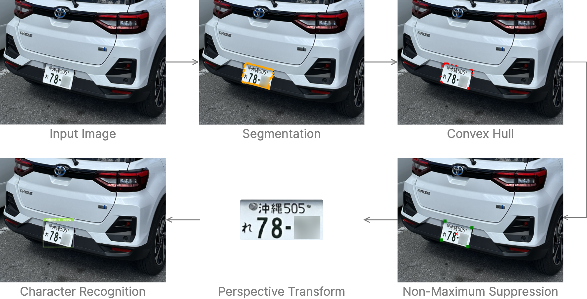

# Japanese License Plate Recognition

Japanese license plate recognition project implemented with PyTorch. For research purpose only.

## Gradio App
### Hugging Face Spaces

Check out the Gradio app on Hugging Face Spaces [https://huggingface.co/spaces/eepj/jlpr](https://huggingface.co/spaces/eepj/jlpr).

## Japanese License Plate Format
### Markings

① Name of Region Registered
 
② Classification Number
 
③ Kana Character
 
④ 4-Digit Designation Number (Leading zeros are shown as ．)

### Color Scheme
<table>
  <tr>
    <th>License Plate Type</th>
    <th>Engine Displacement</th>
    <th>Marking Color</th>
    <th>Background Color</th>
  </tr>
  <tr>
    <td>Private</td>
    <td>≥ 660 cc</td>
    <td>Green</td>
    <td>White</td>
  </tr>
  <tr>
    <td>Private</td>
    <td>< 660 cc</td>
    <td>Black</td>
    <td>Yellow</td>
  </tr>
  <tr>
    <td>Commercial</td>
    <td>≥ 660 cc</td>
    <td>White</td>
    <td>Green</td>
  </tr>
  <tr>
    <td>Commercial</td>
    <td>< 660 cc</td>
    <td>Yellow</td>
    <td>Black</td>
  </tr>
  <tr>
    <td>Commemorative</td>
    <td>–</td>
    <td>Green</td>
    <td>Multiple</td>
  </tr>
  <tr>
    <td>Glowing</td>
    <td>–</td>
    <td>Neon Green</td>
    <td>White</td>
  </tr>
</table>

## Datasets
### License Plates Dataset
* Dataset comprising 350 vehicles and their corresponding license plate bounding boxes for fine-tuning YOLOv8 segmentation model to detect license plates from images.

### alpr_jp
* Dataset comprising 1000+ unlabeled Japanese license plate images for training character recognition models.
* Google Search images were used to supplement the dataset in case of missing or less common markings.
* All markings were manually labeled.

## Approach

## Training
### Model
* CNN adapted from *Chinese License Plate Recognition System Based on Convolutional Neural Network*, layer depths adjusted according to specific recognition task.
### Hardware
* Apple M1 with MPS hardware acceleration

### Hyperparameters
* Number of epochs: 100
* Optimizer: Adam
* Initial learning rate: 1e-3
* Learning rate scheduler: StepLR, reduce by factor of 0.1 every 30 epochs
* Loss function: CrossEntropyLoss
* Random seed: 42

### Data Augmentation
 * Training images were passed to a 7-step augmenetation pipeline to enhance the model's robustness against image quality, camera angles and color variations.

## Performance

### Metrics
<table>
  <tr>
    <th>Recognition Task</th>
    <th>Convolutional Layer Depths</th>
    <th>Samples (Classes)</th>
    <th>Accuracy</th>
    <th>Weighted F1</th>
    <th>Params (×103)</th>
  </tr>
  <tr>
    <td>① Region Name</td>
    <td style="white-space: nowrap;">64, 128, 256, 512</td>
    <td>412 (134)</td>
    <td>0.97573</td>
    <td>0.97265</td>
    <td>1690</td>
  </tr>
  <tr>
    <td>② Classification Number</td>
    <td style="white-space: nowrap;">64, 128, 256</td>
    <td>444 (11)</td>
    <td>0.98423</td>
    <td>0.98426</td>
    <td>440</td>
  </tr>
  <tr>
    <td>③ Kana Character</td>
    <td style="white-space: nowrap;">64, 128, 256, 512</td>
    <td>430 (43)</td>
    <td>0.97907</td>
    <td>0.97837</td>
    <td>680</td>
  </tr>
  <tr>
    <td>④ Designation Number</td>
    <td style="white-space: nowrap;">64, 128, 256, 512</td>
    <td>547 (11)</td>
    <td>0.99817</td>
    <td>0.99817</td>
    <td>646</td>
  </tr>
</table>

### Example Test Case

## References
**alpr_jp**
 
Big thanks to dyama san for sharing the alpr_jp dataset.
 
https://github.com/dyama/alpr_jp

**License Plates Dataset**
 
https://universe.roboflow.com/samrat-sahoo/license-plates-f8vsn

**YOLOv8**
 
https://github.com/ultralytics/ultralytics

**Chinese License Plate Recognition System Based on Convolutional Neural Network**
 
H. Chen, Y. Lin, and T. Zhao, 'Chinese License Plate Recognition System Based on Convolutional Neural Network', Highlights in Science, Engineering and Technology, vol. 34, pp. 95–102, 2023.
 
https://www.researchgate.net/publication/369470024

**ナンバープレートの見方 (How to Read a Number Plate)**
 
https://wwwtb.mlit.go.jp/tohoku/jg/jg-sub29_1.html

## Fun Fact
This repository was created on [Leap Day 2024](https://doodles.google/doodle/leap-day-2024/).
